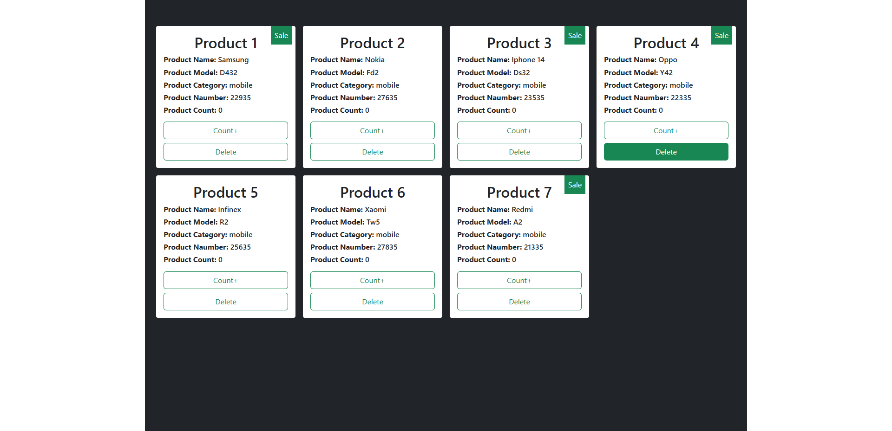

# 🖥️ Product Cart

An engaging and dynamic product cart built with React.js components for seamless interactivity.

## 🌐 Live Demo

Check out the live demo of the project here:  
[Product-Cart Live Demo](https://my-product-cart.vercel.app/)

---

## 🌟 **Features**
- ✅ Feature 1: Utilizes nested components and interactive buttons.
- ✅ Feature 2: Managed state to update data based on user interaction.

---

## 🛠️ **Technologies Used**
- CSS / JavaScript
- React.js
- Bootstrap

